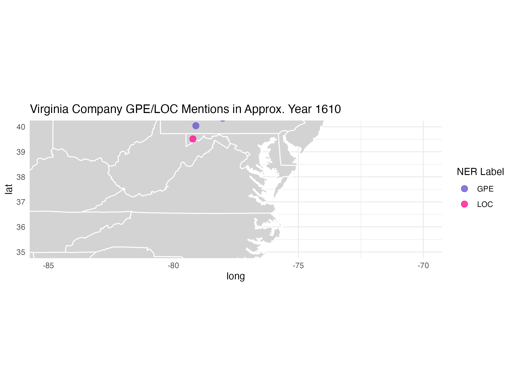

# Colonial Virginia GIS Visualization (R Shiny)

This project is an interactive **R Shiny application** that visualizes geographic entities extracted from historical records of the Virginia Company (1606–1626). The goal is to explore spatial patterns of early colonial settlements and geographic references found in archival texts.

The application combines **OCR text processing, entity extraction, and spatial visualization** to map historical locations and explore how geographic references appear across time.

---

## Live Application

You can explore the deployed Shiny application here:

https://isabella-dataplus.shinyapps.io/dataPlusv2/

The interactive app allows users to explore extracted geographic locations and view visualizations derived from historical documents.

---

## Project Overview

Historical archives often contain geographic references embedded within large volumes of text. In this project:

1. OCR text from the *Records of the Virginia Company* was processed and cleaned.
2. Named entities representing geographic locations were extracted.
3. These entities were organized into structured datasets.
4. The results were visualized using an interactive **R Shiny dashboard**.

The project demonstrates how **data science and visualization tools can be used to analyze historical geographic information and reveal spatial patterns in archival records.**

---

## Features

- Interactive visualization built with **R Shiny**
- Exploration of extracted geographic entities
- Temporal snapshots of colonial Virginia maps
- Integration of historical text-derived data with spatial visualization
- Animated timeline illustrating the development of colonial Virginia

---

## Repository Structure

```
app.R # Main Shiny application
clean_entities.R # Script used to clean extracted entities
entities.csv # Extracted entity dataset
entities_clean.csv # Cleaned entity dataset
extracted_locations.csv # Processed location dataset
suspect_entities.csv # Flagged entities requiring validation
map_1607.png # Map visualization for 1607
map_1610.png # Map visualization for 1610
map_1614.png # Map visualization for 1614
map_1617.png # Map visualization for 1617
map_1622.png # Map visualization for 1622
map_1625.png # Map visualization for 1625
Virginia_Company_Timeline.gif # Animated timeline of colonial development
Vol1StoreOCRPerPage.json # Raw OCR dataset used in the project
```

---

## Example Visualization

Below is an example map generated during the project:



These maps illustrate geographic references found in historical documents and help visualize the expansion and spatial organization of early colonial Virginia.

---

## Technologies Used

- **R**
- **Shiny**
- **ggplot2**
- **Data wrangling in R**
- **OCR text processing**
- **Named Entity Recognition (NER)**

---

## Running the Application Locally

To run the Shiny application locally:

1. Install required packages:

```r
install.packages("shiny")
install.packages("ggplot2")
```

2. Run the application:

```r
library(shiny)
runApp()
```

---

## Data Source

The data used in this project is derived from the *Records of the Virginia Company*, a historical archive documenting early English colonial activity in North America.

OCR text from these documents was processed and analyzed to extract geographic entities referenced throughout the records.

---

## Related Work

This project complements a related pipeline that evaluates how modern NLP models (BERT and BART) can improve entity extraction from noisy OCR text.

GitHub repository:
https://github.com/isabella-x9/ocr-ner-cleanup-pipeline


